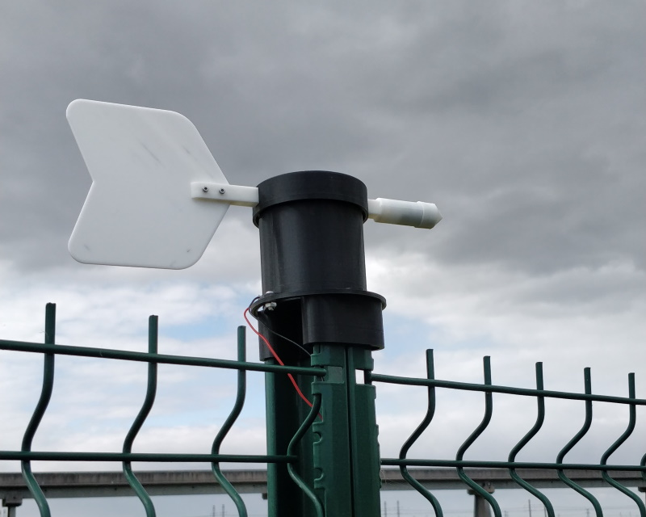
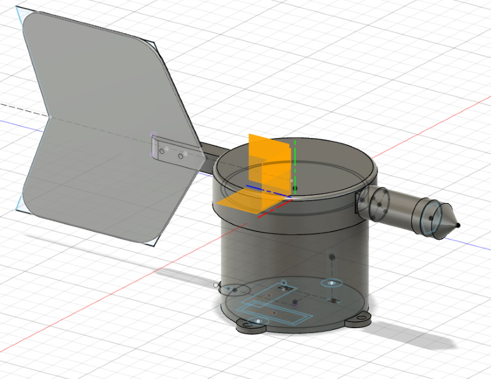
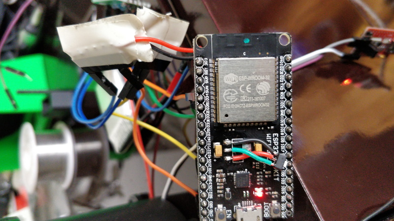

# Solar powered, waterproof windvane

## Foreword

Following my first project ie a [solar powered waterproof anemoter](https://github.com/fguiet/anemometer), let me introduce you : the solar powered waterproof windvane.
Mostly based on the same form factor, I only had to re-designed the top part with Fusion 360.

## In real life

* In place

* Fusion 360 design

* Tampered ESP32 DevKit (I replaced the AMS1117 LDO 1v dropout by HT7333 only 250mA but low dropout)

