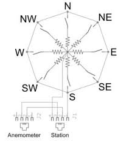
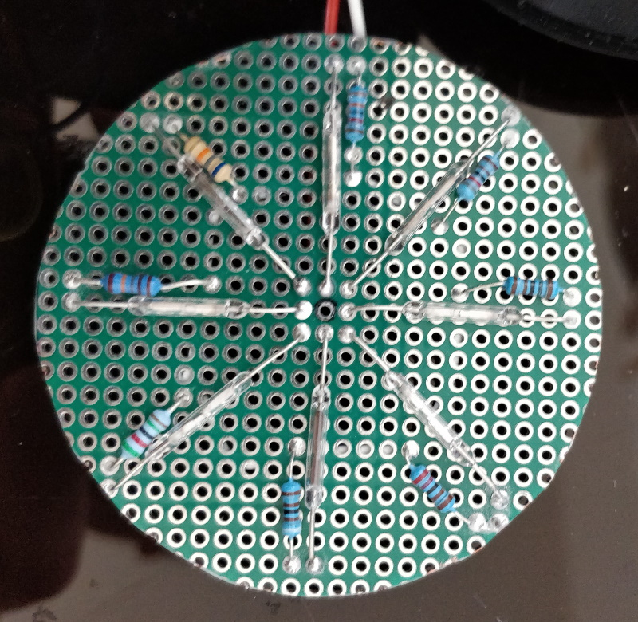
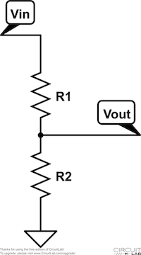
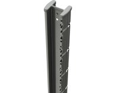
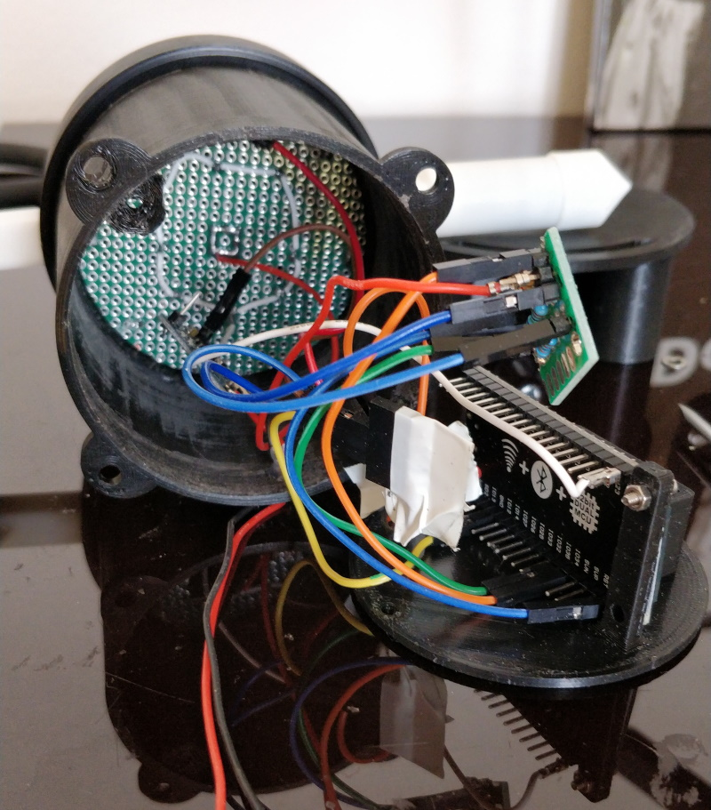
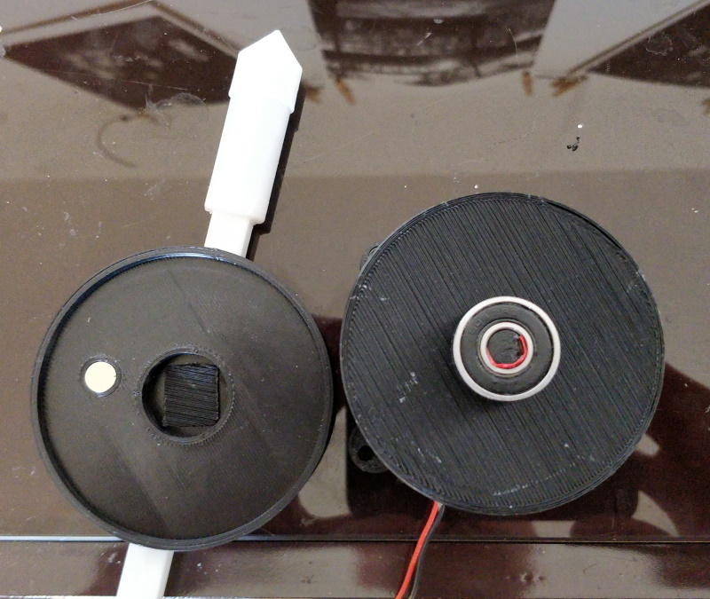

# Solar powered, waterproof windvane

## Foreword

Following my first project ie a [solar powered waterproof anemoter](https://github.com/fguiet/anemometer), let me introduce you : the solar powered waterproof windvane.
Mostly based on the same form factor, I only had to re-designed the top part with Fusion 360.

## How it works ?

There are eight resistors in the wind vane, and as the magnet rotates, different reed switches will open and close and thus switch their corresponding resistor in and out of the circuit.

Schematic reedwitches and resistors

Implementation reedswitches and resistors

Voltage divider (R1 is 10kOhm is this project and R2 will vary regarding how reed switches are open or close)

## Specifications

Electronic spare parts needed :

* 3.7v Lithium battery (650 mAh)
* [Lithium battery charger module TP4056](https://www.aliexpress.com/item/32797834680.html?spm=a2g0o.productlist.0.0.217e1a3fGgFPtZ&algo_pvid=132d3b0e-1179-4677-b1ea-ac7e339a4b3a&algo_expid=132d3b0e-1179-4677-b1ea-ac7e339a4b3a-0&btsid=0b0a3f8115821175486423616e1e40&ws_ab_test=searchweb0_0,searchweb201602_,searchweb201603_)
* [ESP32 DevKit)](https://www.aliexpress.com/item/32818515531.html?spm=a2g0o.productlist.0.0.50cab7b9EZ83s2&algo_pvid=df6b6e13-b443-470e-8411-4b14b9513104&algo_expid=df6b6e13-b443-470e-8411-4b14b9513104-0&btsid=0b0a0ae215856774603992321e9c56&ws_ab_test=searchweb0_0,searchweb201602_,searchweb201603_)
* Home made voltage divider with 2 resitors 33KOhm and 7.5kOhm
* [Solar panel](https://www.aliexpress.com/item/32327321902.html?spm=a2g0s.9042311.0.0.27424c4dXw694V)
* [XH2.54 connectors](https://www.aliexpress.com/item/32751262161.html?spm=a2g0o.productlist.0.0.73ad7920LACtrI&algo_pvid=59f4dba8-049b-412b-b6ab-2ad6a2a0b251&algo_expid=59f4dba8-049b-412b-b6ab-2ad6a2a0b251-1&btsid=0b0a01f815821181817176811e4e9d&ws_ab_test=searchweb0_0,searchweb201602_,searchweb201603_)
* [30 AWG (0.08mm) silicon wire](https://www.aliexpress.com/item/1000006501735.html?spm=a2g0s.9042311.0.0.27424c4d4oyuHy)
* 3.7v Lithium battery (1200 mAh)
* [Bearing 608ZZ](https://www.aliexpress.com/wholesale?catId=0&initiative_id=SB_20200219052438&SearchText=bearing+608)
* [4 neodymium magnets (8mm)](https://www.aliexpress.com/item/32959402237.html?spm=a2g0o.productlist.0.0.6cb72867YDYB0k&algo_pvid=abf99058-7d96-46d5-b91b-2a17fd93094b&algo_expid=abf99058-7d96-46d5-b91b-2a17fd93094b-1&btsid=0b0a187915821195934654449ebf18&ws_ab_test=searchweb0_0,searchweb201602_,searchweb201603_)
* Some resistors
* Some nuts and bolts

## Wiring

Quite easy : 

* Wire positive and negative 3.7v battery to ESP32 DevKit (Careful connect to 5v pin, not 3.3v !!), Voltage divider (the one that will measure the battery voltage),  TP4056 
* Wire the voltage divider that will measure the wind direction to 3.3v pin (that way we have a constant voltage)
* GPIO34 to output of voltage divider (measure wind direction)
* GPIO35 to ouput of voltage divider (measure battery voltage)

## 3D Models

All 3D models can be found on my [Thingiverse for free](https://www.thingiverse.com/thing:4252764) or in the model3d folder of this project

I included a mount system that fits on H pole like this one : 

If needed, I can provide the 3d model solar panel holder

## In real life

* In place

* Inside the beast (we can the custom voltage divider)

* Fusion 360 design

* Tampered ESP32 DevKit (I replaced the AMS1117 LDO 1v dropout by HT7333 only 250mA but low dropout)

* Top view (we can see the bearing)

